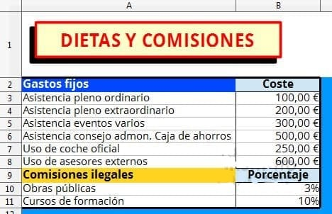
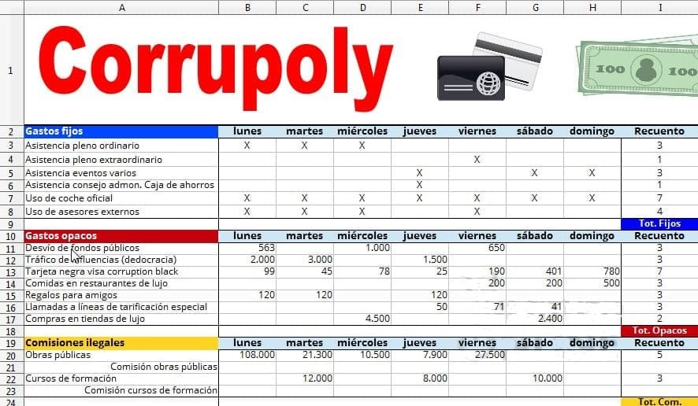
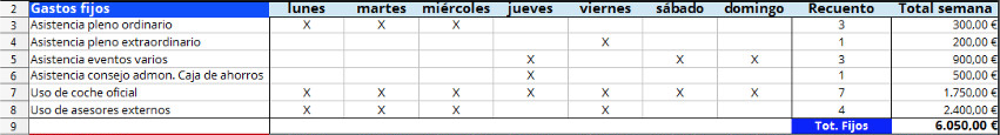
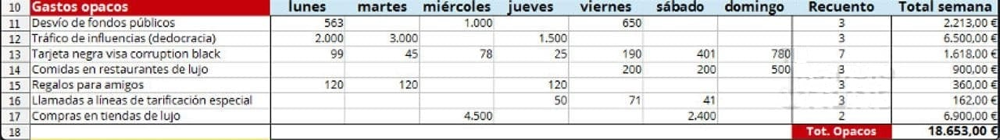
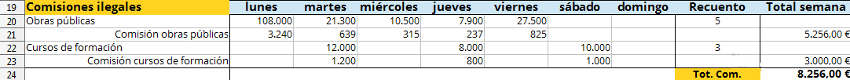
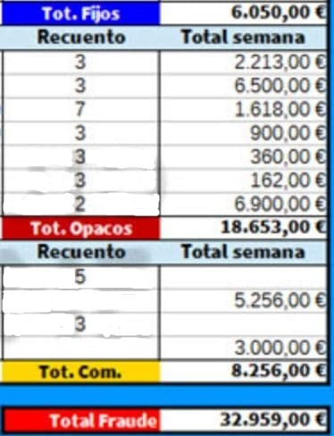
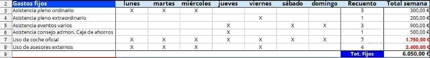
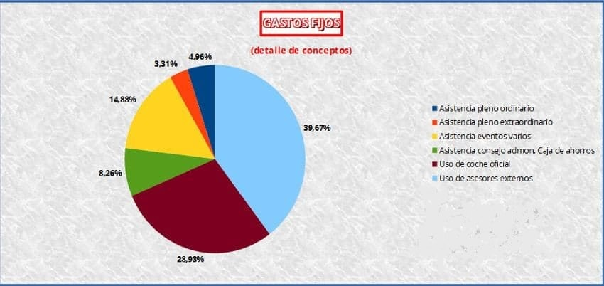
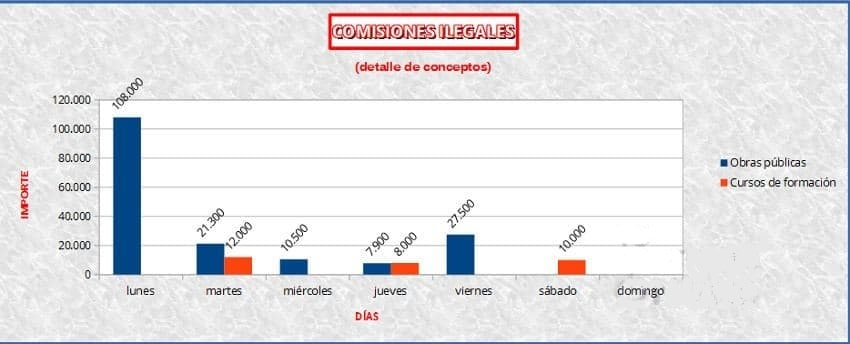

# Tercer Examen Calc - Corrupoly

## Duración

70 minutos.

## Fecha

Viernes 17 de Diciembre de 2020.

## Sobre el formato

Puede utilizarse la **letra, efectos y colores que se desee**. No hace falta que el resultado visual sea idéntico al propuesto en el examen.

## 0 Descarga de imágenes

Descarga las imagen de las tarjetas y ¡los billets!

## 1 Crear nueva hoja

- Crea una nueva hoja de cálculo y sálvala con el nombre `apellido1_apellido2_nombre_examen_corrupoly.ods`.
- **Efectos y colores son aproximados**.
- **Negritas y alineamientos son exactos**.

## 2 Formato e introducción de datos

### Introducción de datos. Hoja 1 (0.5 puntos)

- Renombra `Hoja1` como `Prebendas`.
- Introduce los datos en la hoja tal y como se muestran en la foto.
- Crea un cuadro con el texto `Dietas y comisiones`. Aplica **efecto sombra**.
- Pon formato **Moneda** para los gastos fijos.
- Pon formato **Porcentaje** sin decimales para las comisiones.

### Introducción de datos. Hoja 2 (0.5 puntos)

- Añade una nueva hoja de cálculo dentro del mismo libro de trabajo.
- Renombra `Hoja2` como `Gastos`.
- Introduce los datos en la hoja tal y como se muestran en la foto.
- Crea un rótulo artístico con el texto `Corrupoly`.
- Inserta la imagen de las tarjetas.
- Inserta la imagen de los billets.
- Pon alineación centrada para las `X` de los gastos fijos.
- Pon formato **Cantidad** sin decimales y con separador de miles para las cantidades.

## 3 Fórmulas

### Recuento. Gastos fijos (0.5 puntos)

- Calcula el recuento contando el número de `X` de cada concepto. Utiliza la función **`CONTAR.SI`**.
- Rellena el resto de la columna utilizando la **función autocompletar**.

### Recuento. Gastos opacos y comisiones (0.5 puntos)

- Calcula el recuento contando la cantidad de celdas con números de cada concepto. Utiliza la función **`CONTAR`**.
- Rellena el resto de la columna utilizando la **función autocompletar**.

## 4. Definir nombres (1 punto)

- Define un **nombre** para cada uno de los **gastos fijos** de la **hoja `Prebendas`** de alcance **`Documento(Global)`**.

| Nombre                        | Celda |
|-------------------------------|-------|
| `dieta_pleno_ordinario`       | `B3`  |
| `dieta_pleno_extraordinario`  | `B4`  |
| `dieta_eventos`               | `B5`  |
| `dieta_consejo`               | `B6`  |
| `coche_oficial`               | `B7`  |
| `asesores`                    | `B8`  |

## 5. Totales de gastos

### Gastos fijos (1 punto)

- Calcula el total semanal para los gastos fijos. Utiliza, para las fórmulas, los **nombres definidos en el apartado anterior**.
  - `Asistencia pleno ordinario = Recuento * dieta_pleno_ordinario`
  - `Asistencia pleno extraordinario = Recuento * dieta_pleno_extraordinario`
  - `Asistencia eventos varios = Recuento * dieta_eventos`
  - `Asistencia consejo admon. Caja de ahorros = Recuento * dieta_consejo`
  - `Uso de coche oficial = Recuento * coche_oficial`
  - `Uso de asesores externos = Recuento * asesores`
- Calcula la celda del total de gastos fijos. Utiliza la **función Autosuma**.
- Pon formato **Moneda** para la columna del total semana.

### Gastos opacos (1 punto)

- Calcula el total semanal para los gastos opacos. Utiliza la **función Autosuma**.
  - `Total semana = Lunes + Martes + Miércoles + Jueves + Viernes`
- Calcula la celda del total de gastos opacos. Utiliza la **función Autosuma**.
- Pon formato Moneda para la columna del total semanal.

## 6. Comisiones (2 puntos)

- Calcula la cantidad de comisión de cada concepto. Utiliza **referencias absolutas** en la fórmula.
  - `Comisión Obras públicas = Importe * % Comisión Obras públicas (hoja Prebendas)`
  - `Comisión Cursos de formación = Importe * % Comisión Cursos de formación (hoja Prebendas)`
- Calcula el total de gasto para las comisiones. Utiliza la **función Autosuma**.
  - `Total semana = Lunes + Martes + Miércoles + Jueves + Viernes`
- Calcula la celda del total de comisiones. Utiliza la **función Autosuma**.
- Pon formato **Moneda** para la columna del total semanal.

### Total fraude

- Calcula la cantidad total de fraude.
  - `Total fraude = Tot. fijos + Tot. opacos + Tot. com`.
- Pon formato **Moneda** para la celda de la cantidad total de fraude.

## 7. Formato condicional (1 puntos)

- Crea un nuevo estilo llamado `Condicion1000` con la fuente en **negrita** de color **rojo**.
- Define un formato condicional para el rango `J3` a `J8`. Añade la condición para que si el número es **mayor o igual a 1000**, se visualice con el estilo `Condicion1000`.

## 8. Gráficos

### Gráfico 1. Circular (1 punto)

- Selecciona el rango de datos `A2` a `A8` y `J2` a `J8`.
- Crea un gráfico de **Círculo (tipo Normal)**.
- Escribe los títulos correspondientes.
- Muestra los porcentajes con 2 decimales.
- Sitúa los porcentajes fuera del círculo.

### Gráfico 2. Columnas (1 punto)

- Selecciona el rango de datos `A19` a `H20` y `A22` a `H22`.
- Crea un gráfico de **Columna (tipo Normal)**.
- Escribe los títulos correspondientes.
- Muestra los valores de las series.
- **Gira los valores 45º** para que se puedan leer bien.

## 9. Subir el examen

- Guarda los cambios.
- Cierra la hoja de cálculo.
- Sube el fichero `apellido1_apellido2_nombre_examen_corrupoly.ods` a la plataforma.